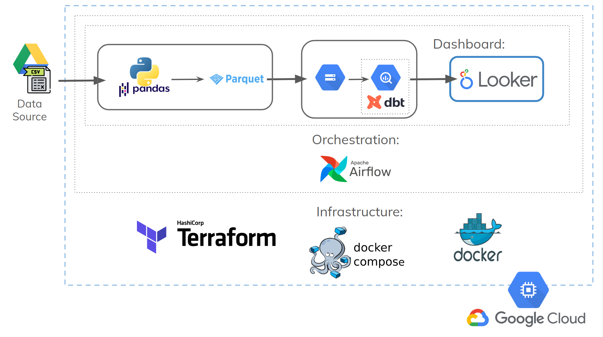
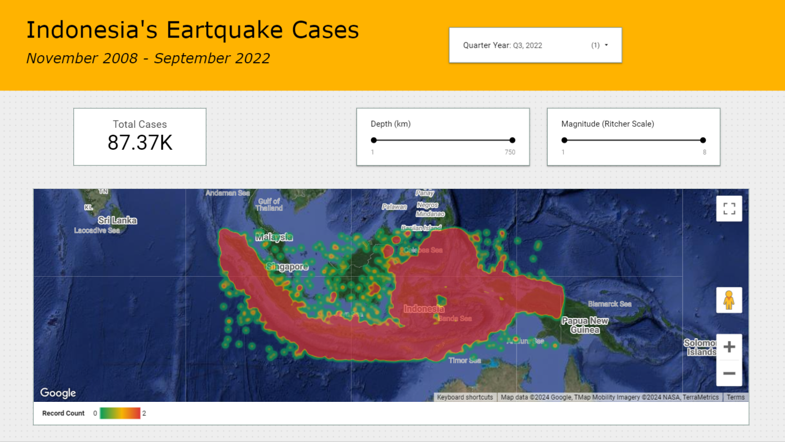
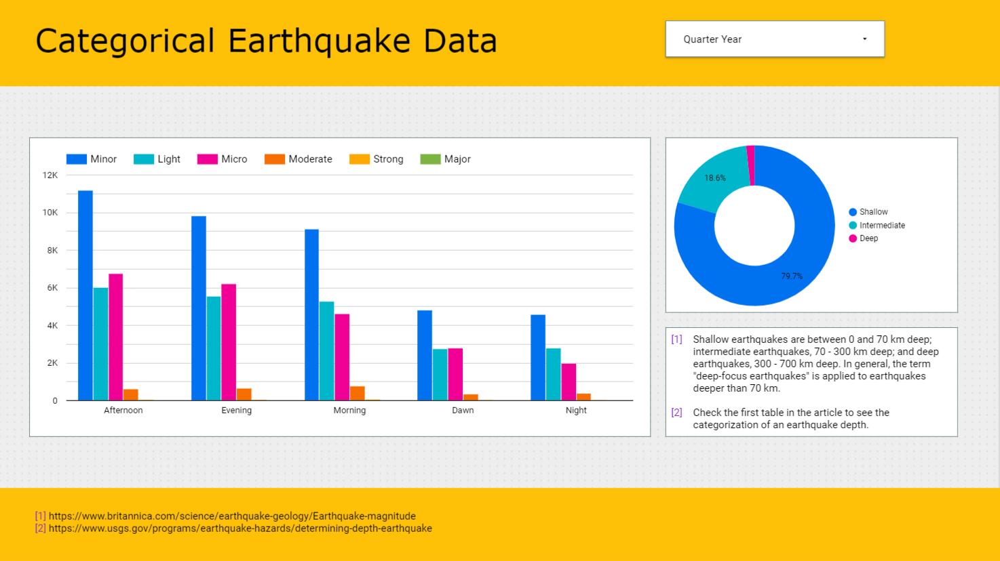
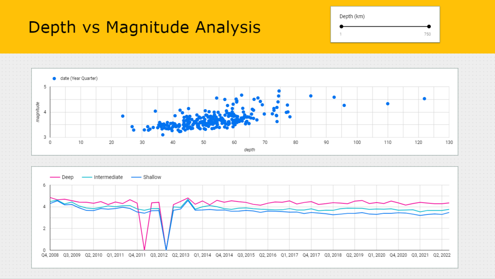

# Analyzing Indonesia's Earthquake Data - *A Data Engineering Project*

## ⛰️ Background
Indonesia is known to be one of the most seismically active countries in the world due to its location on the Pacific Ring of Fire. Earthquakes, ranging from minor to catastrophic, occur frequently across the archipelago. Understanding the patterns, trends, and impacts of these earthquakes is crucial for disaster preparedness, mitigation, and response efforts.

## 🚩 Problem Statement
The objective of this project is to analyze earthquake data in Indonesia to gain insights into various aspects of seismic events. The analysis will focus on the following key areas:

1. **Geographical Distribution Analysis:** Explore the spatial distribution of earthquake disasters, considering filters such as time, magnitude, and depth, to identify high-risk areas and assess temporal trends in seismic activity.

2. **Categorical Data Distribution Analysis:** Investigate categorical characteristics of earthquakes, including earthquake categories based on magnitude, depth categories, and day periods, to understand the frequency and distribution of seismic events across different categories.

3. **Depth vs Magnitude Analysis:** Explore the relationship between earthquake depth and magnitude, identify trends and patterns over time, particularly focusing on how average magnitude varies with depth categories.

## 📑 Data Sources
The data for this analysis is sourced from Kaggle, accessible through the following link: [Indonesia Earthquake Data](https://www.kaggle.com/datasets/greegtitan/indonesia-earthquake-data).

The dataset belongs to the Badan Meteorologi, Klimatologi, dan Geofisika (BMKG) Indonesia, which translates to the Meteorology, Climatology, and Geophysical Agency in English. The original data is available on the BMKG's official website at [dataonline.bmkg.go.id/data_gempa_bumi](dataonline.bmkg.go.id/data_gempa_bumi).

**Temporal Coverage:**
- **Start Date:** November 1, 2008
- **End Date:** September 29, 2022

**Geospatial Coverage:** Indonesia

The dataset includes the following columns:
- **Date and Time:** Timestamp of the earthquake event
- **Latitude and Longitude:** Geolocation coordinates of the earthquake
- **Depth:** Depth of the earthquake hypocenter in kilometers
- **Magnitude:** Measurement of the earthquake's strength on the Richter scale

Sample of the first 5 rows:

| date       | time     | latitude | longitude | depth | magnitude |
|------------|----------|----------|-----------|-------|-----------|
| 2008-11-01 | 00:31:25 | -0.6     | 98.89553  | 20.0  | 2.99      |
| 2008-11-01 | 01:34:29 | -6.61    | 129.38722 | 30.1  | 5.51      |
| 2008-11-01 | 01:38:14 | -3.65    | 127.99068 | 5.0   | 3.54      |
| 2008-11-01 | 02:20:05 | -4.2     | 128.097   | 5.0   | 2.42      |
| 2008-11-01 | 02:32:18 | -4.09    | 128.20047 | 10.0  | 2.41      |

This CSV dataset has been uploaded to Google Drive, and the data source for this project will be sourced from there for extraction.


## 🛠️ Infrastructure
- **Cloud**: Google Cloud Platform
- **Infrastructure as Code (IaC)**: Terraform
- **Containerization**: Docker, Docker Compose
- **Batch Processing**: Python
- **Orchestration**: Airflow
- **Transformation**: dbt
- **Data Lake**: Google Cloud Storage (GCS)
- **Data Warehouse**: BigQuery
- **Data Visualization**: Looker Studio

<p align="center">
  
<p>


Airflow DAG View:
<p align="center">
  
<p>

dbt Lineage View:
<p align="center">
  
<p>

#### Clustering and Partitioning in the Data Warehouse
```sql
# earthquake_partitioned.sql
{{ config(
    materialized = 'table',
    partition_by = {
        'field': 'date',
        'data_type': 'date',
        'granularity': 'year'
    },
    cluster_by = [
        'earthquake_category',
        'depth_category',
        'day_period'
    ]
)}}

SELECT *
FROM {{ ref('add_depth_category') }}
```
- Why Use `Year` for Partitioning?

  Partitioning the table by year based on the `date` column allows for efficient data retrieval when filtering by quarter year. This choice optimizes query performance by restricting the scan to only relevant partitions, reducing the amount of data that needs to be processed.

- Why Use `earthquake_category`, `depth_category`, and `day_period` for Clustering?

  Clustering the table based on the `earthquake_category`, `depth_category`, and `day_period` columns is advantageous because these columns are likely to be frequently used for aggregation operations. By clustering the data based on these columns, similar values within each cluster are physically stored together on disk. This arrangement can significantly improve the performance of aggregation queries, as the related data is co-located and can be efficiently accessed without the need for extensive data shuffling. Additionally, clustering on these columns can enhance the efficiency of certain types of joins and filtering operations that involve these attributes.


## 📊 Dashboard
Here is the link to the [dashboard](https://lookerstudio.google.com/reporting/38993308-4ed8-4351-9fb4-8379103a9db9).
<p align="center">
  
<p>
<p align="center">
  
<p>
<p align="center">
  
<p>


## ♾️ How to reproduce this project?
### SSH Matters (Creating SSH Keys and Connecting) [[source](https://cloud.google.com/compute/docs/connect/create-ssh-keys)]

```bash
# Creating an SSH file (just fill in the filename and username). Do this on your local computer (Gitbash)
cd ~/.ssh
ssh-keygen -t rsa -f ~/.ssh/gcp-capstone -C marli -b 2048
# After that, go to Compute Engine >> Settings >> Metadata, and enter your public key there.

# Connecting to the server (using a shortcut is, of course, more convenient)
ssh -i ~/.ssh/gcp marli@<external IP>
```


### Create a VM on GCP with the following recommended VM Spec modifications (leave the rest as default)
- Machine type: `e2-standard-4 (4 vCPU, 16 GB Memory)`
- Boot Disk OS version: `Ubuntu 20.04 LTS`
- Boot Disk size: `30 GB`


### Docker Installation [[Docker without Sudo Tutorial](https://github.com/sindresorhus/guides/blob/main/docker-without-sudo.md)]
```bash
sudo apt-get update
sudo apt-get install docker.io

sudo groupadd docker
sudo gpasswd -a $USER docker # Log out, then log back in via SSH
sudo service docker restart
```


### Docker Compose Installation
Go to [this link](https://github.com/docker/compose/releases) and look for docker-compose-linux-x86_64, then copy its URL link.
```bash
mkdir bin
cd bin
wget https://github.com/docker/compose/releases/download/v2.26.1/docker-compose-linux-x86_64 -O docker-compose    # -O specifies the output filename
chmod +x docker-compose

cd
nano .bashrc  # add export PATH="${HOME}/bin:${PATH}" at the bottom
source .bashrc
```


### Terraform Installation
Download the Terraform package and install it with the following commands:

```bash
cd bin
wget https://releases.hashicorp.com/terraform/1.7.5/terraform_1.7.5_linux_amd64.zip
sudo apt-get install unzip
unzip terraform_1.7.5_linux_amd64.zip
rm terraform_1.7.5_linux_amd64.zip
```


### Upload a Service Account File via SFTP
```bash
# Create a directory for the Google Cloud service account file if it doesn't exist
mkdir .gc

# Navigate to the directory
cd .gc

# Use the SFTP command to connect to your server and then use the `put` command to upload the service-account.json file
# Example:
# sftp username@your_server_ip_or_hostname
# Once logged in:
# put service-account.json
```

### Final Checks
```bash
gcloud --version
docker ps
docker run hello-world
which docker-compose
docker-compose version
terraform -version
```


### Set up Terraform and Airflow
`git clone` this project.

#### Terraform
```bash
cd earthquake-zoomcam/terraform
nano `variables.tf` # update names
terraform init
terraform fmt
terraform apply
```

#### Airflow
```bash
cd earthquake-zoomcam/airflow
nano Dockerfile # Update service account in Dockerfile

cd airflow/dags
cp ~/.gc/<service_account_filename.json> <service_account_filename.json>
nano earthquake_dag.py 
```
Change the following lines as indicated below:
```python
service_account_key_file = '/tmp/<service-account-filename>'
BUCKET_NAME = 'Your Bucket Name'
DATASET_NAME = 'Your Dataset Name'
```

```bash
export AIRFLOW_UID=1000 # If Airflow warns about needing definition

docker-compose up airflow-init
docker-compose up -d 
```
- Login using **admin=*airflow*** and **passsword=*airflow***.
- Configuring Connection **Admin > Connections**. Then, trigger the dag.

Configuring GCP Connection at **Admin > Connections**:
<p align="center">
  
<p>

DAGs View:
<p align="center">
  
<p>


#### dbt
Navigate to **airflow/dags/dbt/zoomcamp_dbt/profiles.yml**.

Update the keyfile to your service account JSON file path and BigQuery schema name.

Navigate to **airflow/dags/dbt/zoomcamp_dbt/models/earthquacke_silver/src_zoomcamp.yml**.
Change the BigQuery table schema name.

❗ Use `sudo nano` or adjust permissions if there are issues with saving changes. ❗


## 💐 Special Mention
I express my gratitude to [DataTalks.Club](https://datatalks.club) for providing this Data Engineering course at no cost 🙏. For those interested in enhancing their skills in Data Engineering technologies, I recommend exploring their self-paced [course](https://github.com/DataTalksClub/data-engineering-zoomcamp). 😁👌
